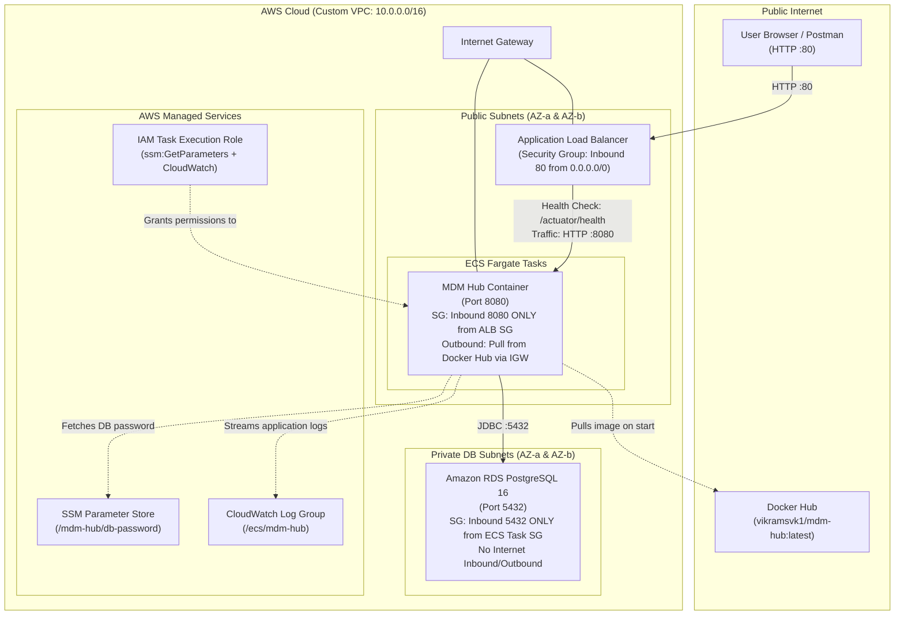

# MDM Hub — AWS Terraform Deployment & Learning Plan

> **Image**: `vikramsvk1/mdm-hub:latest` (Docker Hub)  
> **Target Cloud**: AWS  
> **Infrastructure as Code**: Terraform (Consolidated `main.tf`)  
> **Primary Goal**: Rapid experimentation, cost-effective deployment, and hands-on revision of core AWS services.

---

## 1. Architectural Decisions Summary

Based on the interactive design review, here are the architectural choices aligned with learning AWS best practices while keeping running costs near zero:

| Layer | Decision | AWS Services / Components | Rationale & Cost Impact |
| :--- | :--- | :--- | :--- |
| **Compute** | Serverless Containers | **AWS ECS (Fargate)** | No EC2 instances to patch or manage. Pay-as-you-go per vCPU/RAM (0.25 vCPU, 0.5 GB RAM is ~$0.01/hr). |
| **Ingress** | Load Balancer | **Application Load Balancer (ALB)** | Public entry point on HTTP (port 80), routes traffic to ECS targets and runs Spring Boot Actuator health checks. |
| **Database** | Managed Relational DB | **Amazon RDS PostgreSQL** (`db.t4g.micro`) | Free Tier eligible (750 hours/month for 12 months). Automated backups, managed updates, and native Postgres engine. |
| **Networking** | Cost-Optimized Custom VPC | **VPC + IGW + 2 Public & 2 Private Subnets** | **No NAT Gateway** (saves ~$32/month). ECS tasks run in public subnets with `assign_public_ip = true` to pull `vikramsvk1/mdm-hub:latest` from Docker Hub, but are locked down by Security Groups so only the ALB can reach them. |
| **Secrets & Config** | Free Secure Storage | **AWS Systems Manager (SSM) Parameter Store** | 100% free tier (`SecureString`). Injected natively into the ECS Task Definition via IAM Task Execution Role. |
| **Observability** | Centralized Logging | **AWS CloudWatch Logs** | Streams container stdout/stderr (Spring Boot logs) to a dedicated log group with 7-day retention. |
| **File Layout** | Consolidated Single-File | `terraform/main.tf` | Minimal context switching; inspect the entire cloud topology in one file. |
| **State** | Local State | `terraform.tfstate` | Instant setup, no S3/DynamoDB bootstrapping needed, clean `terraform destroy`. |

---

## 2. Architecture Diagram



---

## 3. AWS Services Revision & Learning Map

Working through this Terraform deployment provides hands-on revision of core AWS and DevOps concepts:

### 1. Amazon VPC & Networking Primitives
- **VPC & CIDR Blocks**: Defining private address space (`10.0.0.0/16`) and slicing it into subnets (`10.0.1.0/24`, `10.0.2.0/24` for public; `10.0.10.0/24`, `10.0.20.0/24` for private).
- **Internet Gateway (IGW) & Route Tables**: Public subnets have route `0.0.0.0/0 -> igw_id`. Private subnets have no internet route.
- **Multi-AZ High Availability**: AWS requires ALBs and RDS Subnet Groups to span across at least two Availability Zones (e.g., `us-east-1a` and `us-east-1b` or `ap-south-1a` and `ap-south-1b`).
- **Security Group Chaining (Defense in Depth)**:
  - `ALB SG`: Inbound port `80` from `0.0.0.0/0`.
  - `ECS Task SG`: Inbound port `8080` **strictly** from `ALB SG` (direct internet traffic to the container's public IP is dropped).
  - `RDS SG`: Inbound port `5432` **strictly** from `ECS Task SG` (completely unreachable from outside the VPC).

### 2. AWS Elastic Container Service (ECS Fargate)
- **ECS Cluster**: Logical grouping of containerized tasks.
- **ECS Task Definition**: Blueprint defining container resources (0.25 vCPU, 512 MB RAM), environment variables (`DB_HOST`, `DB_PORT`, `DB_NAME`, `DB_USER`, `SERVER_PORT`), secrets injection, port mapping, and log driver.
- **ECS Service**: Maintains the desired replica count (1), manages rolling deployments, and registers containers with the target group.
- **IAM Roles**:
  - **Task Execution Role**: Used by the AWS ECS agent before the container starts (pulling image, fetching SSM parameter, creating CloudWatch log stream).
  - **Task Role**: Used by code inside the container (if calling AWS APIs).

### 3. Application Load Balancer (ALB)
- **Listeners & Rules**: Forward incoming HTTP traffic on port 80 to the target group.
- **Target Groups (type: `ip`)**: Fargate tasks use `awsvpc` network mode, requiring target group type `ip` rather than `instance`.
- **Health Checks**: Using Spring Boot Actuator (`/actuator/health`) on port 8080. If PostgreSQL is reachable, Actuator reports status `UP` (HTTP 200). If DB is unreachable, it reports `DOWN` (HTTP 503), preventing traffic from routing to unhealthy tasks.

### 4. Amazon RDS (Relational Database Service)
- **DB Subnet Group**: Pairs of private subnets across 2 AZs.
- **Engine & Sizing**: PostgreSQL 16 on `db.t4g.micro` (AWS Graviton2, Free Tier eligible), 20 GB `gp3` storage.
- **Storage Lifecycle**: `skip_final_snapshot = true` enables quick teardown with `terraform destroy`.

### 5. AWS Systems Manager (SSM) Parameter Store
- Stores the database password as a `SecureString` encrypted with AWS KMS (`alias/aws/ssm`).
- Password is generated automatically by Terraform's `random_password` provider and never hardcoded in Git.
- Injected into ECS container definitions using the `secrets` attribute.

---

## 4. Terraform Manifest Specification (`terraform/main.tf`)

The single `main.tf` file will declare:

1. **Terraform & Provider Setup**:
   - `aws` (~> 5.0), `random` (~> 3.5).
   - Region variable defaulting to `ap-south-1` (or `us-east-1`).
2. **VPC & Subnets**:
   - `aws_vpc`
   - `aws_internet_gateway`
   - 2x `aws_subnet` (public)
   - 2x `aws_subnet` (private)
   - `aws_route_table` & `aws_route_table_association`
   - `aws_db_subnet_group`
3. **Security Groups**:
   - `aws_security_group.alb`
   - `aws_security_group.ecs_task`
   - `aws_security_group.rds`
4. **Secrets & Credentials**:
   - `random_password.db_password`
   - `aws_ssm_parameter.db_password`
5. **Database**:
   - `aws_db_instance.postgres` (PostgreSQL 16, `db.t4g.micro`, 20GB gp3)
6. **IAM & Logging**:
   - `aws_iam_role.ecs_execution_role`
   - `aws_iam_role_policy_attachment.ecs_execution_standard`
   - `aws_iam_role_policy.ecs_ssm_read`
   - `aws_cloudwatch_log_group.mdm_hub`
7. **Compute (ECS)**:
   - `aws_ecs_cluster.main`
   - `aws_ecs_task_definition.mdm_hub`
   - `aws_ecs_service.mdm_hub`
8. **Load Balancing**:
   - `aws_lb.main`
   - `aws_lb_target_group.mdm_hub`
   - `aws_lb_listener.http`
9. **Outputs**:
   - `alb_dns_name`
   - `swagger_ui_url` (`http://<alb-dns>/swagger-ui.html`)
   - `health_check_url` (`http://<alb-dns>/actuator/health`)
   - `rds_endpoint`

---

## 5. Deployment Step-by-Step Guide

### Prerequisites
1. **AWS CLI** installed and configured (`aws configure` with an active IAM user/role having Administrator or PowerUser permissions).
2. **Terraform CLI** (>= 1.5.0) installed.

### Step 1: Initialize Terraform
```bash
cd terraform
terraform init
```

### Step 2: Validate & Plan
```bash
terraform validate
terraform plan
```
Review the planned resources (~25 resources).

### Step 3: Apply Infrastructure
```bash
terraform apply -auto-approve
```
*Note: RDS PostgreSQL creation typically takes between 4 to 7 minutes. Once completed, Terraform will output the ALB URLs.*

### Step 4: Verify Deployment

1. **Check Health Check**:
   ```bash
   curl http://<ALB_DNS_NAME>/actuator/health
   # Expected output: {"status":"UP","components":{"db":{"status":"UP",...},...}}
   ```

2. **Open Swagger UI**:
   Navigate in your browser to:
   ```
   http://<ALB_DNS_NAME>/swagger-ui.html
   ```

3. **Test API Endpoints via cURL**:
   ```bash
   # 1. Register a Source System
   curl -X POST http://<ALB_DNS_NAME>/api/source-systems \
     -H 'Content-Type: application/json' \
     -d '{"code":"CRM","name":"Salesforce CRM","description":"Main CRM system"}'

   # 2. Create a Master Party (Golden Record)
   curl -X POST http://<ALB_DNS_NAME>/api/parties \
     -H 'Content-Type: application/json' \
     -d '{"partyType":"INDIVIDUAL","firstName":"Vikram","lastName":"Shanbogar","email":"vikram@example.com"}'

   # 3. Fetch Parties
   curl http://<ALB_DNS_NAME>/api/parties
   ```

4. **View Container Logs in CloudWatch**:
   ```bash
   aws logs tail /ecs/mdm-hub --follow
   ```

### Step 5: Clean Teardown (Avoid Unwanted Charges)
When finished experimenting:
```bash
terraform destroy -auto-approve
```
This safely deletes the ALB, ECS tasks, RDS instance, security groups, and VPC resources, leaving $0 residual cost.
